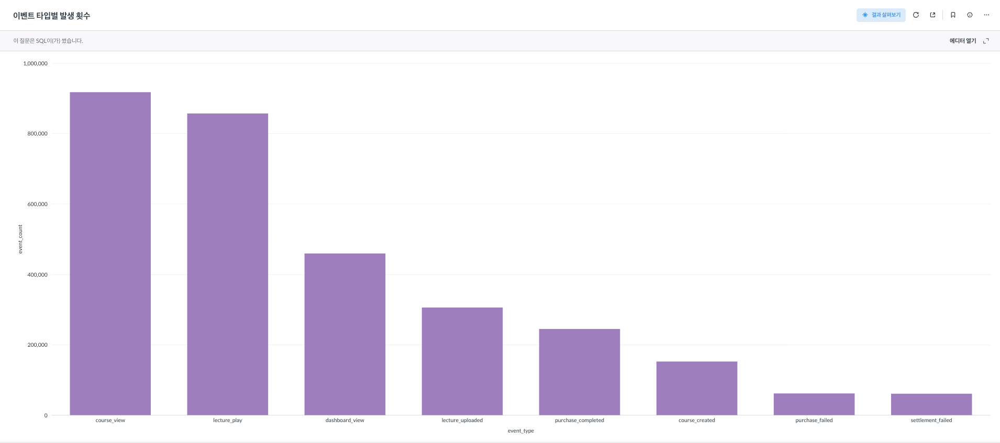
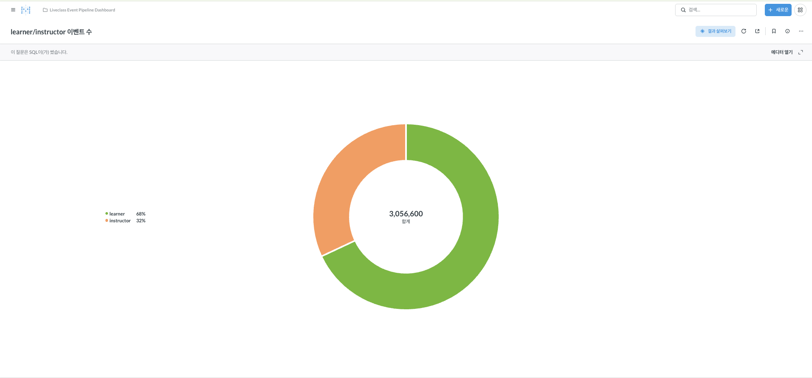
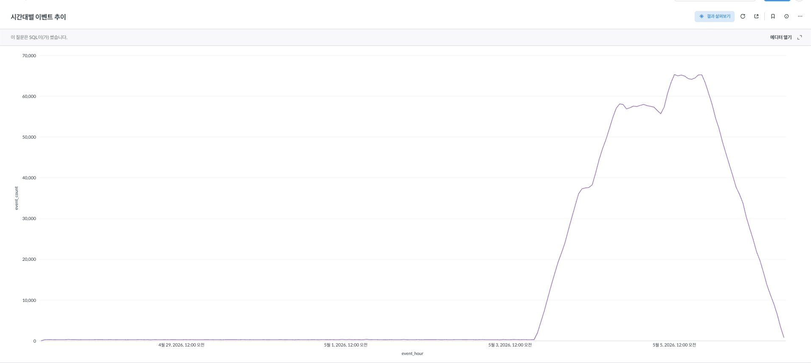
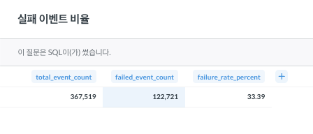

# Event Log Pipeline

## 과제 해석 및 구현 방향

이 프로젝트는 온라인 강의 플랫폼에서 실제로 발생할 수 있는 수강생과 강사의 행동 데이터를 가정하여,
이벤트 생성, PostgreSQL 저장, SQL 집계 분석, Metabase 시각화까지 이어지는 데이터 파이프라인을 구성한 과제입니다.

과제에서 요구한 흐름은 이벤트 생성 → 저장 → 분석 → 시각화였습니다.
저는 이 흐름을 실제 서비스에서 이벤트 로그가 수집되고 분석에 활용되는 최소 단위의 파이프라인으로 해석했습니다.
따라서 로컬 환경에서 `docker compose up` 한 번으로 이벤트 생성 앱, PostgreSQL, Metabase가 함께 실행되도록 구성했습니다.

## 전체 흐름

```text
Python event generator
        |
        v
PostgreSQL events table
        |
        v
SQL aggregation queries
        |
        v
Metabase dashboard
```

## 프로젝트 구성

| 경로 | 역할 |
| --- | --- |
| `app/events.py` | 온라인 강의 플랫폼의 이벤트 데이터를 랜덤 생성합니다. |
| `app/storage.py` | PostgreSQL 연결, 스키마 초기화, 이벤트 batch insert를 담당합니다. |
| `app/main.py` | 초기 seed 적재 후 주기적으로 이벤트를 계속 생성하고 저장합니다. |
| `sql/schema.sql` | `events` 테이블과 인덱스를 정의합니다. |
| `sql/queries/` | 저장된 이벤트를 분석하는 SQL 쿼리를 보관합니다. |
| `metabase/setup.py` | Metabase 초기 계정과 PostgreSQL datasource를 자동 설정합니다. |
| `docker-compose.yml` | 앱, PostgreSQL, Metabase를 함께 실행합니다. |
| `docs/images/` | Metabase 시각화 결과 이미지를 보관합니다. |

## 실행 방법

### 필요 도구

- Docker
- Docker Compose

### 실행

```bash
docker compose up -d --build
```

처음 실행하면 다음 서비스가 함께 실행됩니다.

| 서비스 | 설명 | 기본 포트 |
| --- | --- | --- |
| `app` | 이벤트 생성 및 저장 앱 | - |
| `postgres` | 이벤트 저장소 | `5432` |
| `metabase` | 이벤트 분석 및 시각화 도구 | `3000` |
| `metabase-setup` | Metabase 초기 설정용 일회성 컨테이너 | - |

앱 컨테이너는 PostgreSQL이 준비된 뒤 실행됩니다.
처음 실행 시 `events` 테이블을 생성하고 초기 이벤트 50,000건을 적재합니다.
이후에는 5초마다 100건의 이벤트를 추가로 생성해 저장합니다.

### 상태 확인

```bash
docker compose ps
docker compose logs -f app
```

PostgreSQL에 저장된 이벤트 수는 아래 명령으로 확인할 수 있습니다.

```bash
docker exec -it liveclass-postgres psql -U liveclass -d liveclass -c "SELECT COUNT(*) FROM events;"
```

### Metabase 접속

- URL: http://localhost:3000
- Email: `admin@liveclass.local`
- Password: `Liveclass!2026`
- Database: `Liveclass Events`

`metabase-setup` 컨테이너가 Metabase 관리자 계정과 PostgreSQL datasource를 자동으로 생성합니다.
이미 설정된 상태에서 다시 실행하면 기존 계정으로 로그인하고,
`Liveclass Events` datasource가 이미 있으면 중복 생성하지 않습니다.

### 종료

```bash
docker compose down
```

데이터까지 모두 초기화하려면 아래 명령을 사용합니다.

```bash
docker compose down -v
```

## 이벤트 설계

온라인 강의 플랫폼은 수강생이 강의를 탐색하고 수강하는 흐름과,
강사가 강의 콘텐츠와 정산 상태를 관리하는 흐름이 함께 존재한다고 보았습니다.
따라서 이벤트를 수강생 행동과 강사 행동으로 나누어 설계했습니다.

데이터 값으로는 수강생을 `learner`, 강사를 `instructor`로 저장했습니다.

| event_type | actor_role | 설명 |
| --- | --- | --- |
| `course_view` | `learner` | 수강생이 강의 상세 페이지를 조회한 이벤트입니다. |
| `lecture_play` | `learner` | 수강생이 강의를 재생한 이벤트입니다. |
| `purchase_completed` | `learner` | 수강생의 강의 구매가 완료된 이벤트입니다. |
| `purchase_failed` | `learner` | 결제 실패, 타임아웃 등으로 구매가 실패한 이벤트입니다. |
| `course_created` | `instructor` | 강사가 새 강의를 생성한 이벤트입니다. |
| `lecture_uploaded` | `instructor` | 강사가 강의 영상을 업로드한 이벤트입니다. |
| `dashboard_view` | `instructor` | 강사가 관리 대시보드를 조회한 이벤트입니다. |
| `settlement_completed` | `instructor` | 강사 정산이 완료된 이벤트입니다. |
| `settlement_failed` | `instructor` | 강사 정산 과정에서 실패가 발생한 이벤트입니다. |

이벤트 발생 비율은 온라인 강의 플랫폼에서 모든 이벤트가 동일한 빈도로 발생하지 않는다고 가정하고 weight를 두었습니다.
예를 들어 강의 조회와 강의 재생은 자주 발생하고,
구매 실패나 정산 실패는 상대적으로 드물게 발생하도록 설정했습니다.

초기 seed 데이터는 최근 7일 범위에 분산되도록 생성했습니다.
단일 시점에만 이벤트가 몰리면 시간대별 이벤트 추이 차트가 의미를 갖기 어렵기 때문입니다.

## 저장소 선택 이유

현업의 대규모 이벤트 로그 파이프라인에서는 Kafka/Kinesis 같은 스트리밍 시스템으로 이벤트를 수집하고,
S3 같은 데이터 레이크에 원본 로그를 저장한 뒤,
Redshift, BigQuery, Snowflake 같은 데이터 웨어하우스에서 분석하는 구조를 많이 사용합니다.

다만 이번 과제는 로컬 환경에서 `docker compose up` 한 번으로 실행 가능한 작은 파이프라인을 만드는 것이 목표라고 판단했습니다.
처음부터 Kafka, S3, 데이터 웨어하우스까지 포함하면 메시지 브로커, 객체 저장소, 적재 작업, 분석 저장소를 모두 관리해야 하므로
과제 범위에 비해 관리 포인트가 커진다고 보았습니다.
따라서 이번 구현에서는 이벤트 생성, 저장, SQL 분석, 시각화 흐름을 PostgreSQL과 Metabase 중심으로 단순하게 구성했습니다.

JD에는 MySQL/MariaDB가 명시되어 있고, MySQL이나 MariaDB로도 같은 구조를 구현할 수 있습니다.
다만 이번 과제에서는 시간대별 이벤트 추이와 실패 이벤트 비율 같은 분석 쿼리를 간결하게 표현하기 위해 PostgreSQL을 선택했습니다.
PostgreSQL의 `TIMESTAMPTZ`, `DATE_TRUNC()`, `FILTER` 구문을 활용하면 시간 기반 집계와 조건부 집계를 명확하게 작성할 수 있습니다.
실무에서는 개인 선호보다 팀의 표준 스택과 운영 환경을 우선해 저장소를 선택할 것입니다.

또한 `CHECK` 제약 조건으로 `event_type`, `actor_role`의 허용값을 제한할 수 있어 이벤트 스키마의 기본 품질을 유지하기 쉽습니다.

MongoDB는 이벤트 payload가 자주 바뀌거나 document 형태의 원본 이벤트를 빠르게 적재해야 할 때 좋은 선택지가 될 수 있습니다.
다만 이번 과제에서는 JSON document 저장보다 필드 단위 저장, SQL 집계, BI 도구 연동을 보여주는 것이 중요하다고 판단했습니다.
그래서 유연한 document 저장소보다는 명시적인 스키마와 SQL 분석이 가능한 PostgreSQL을 선택했습니다.

Redis, Elasticsearch/OpenSearch, Vector DB, MQ도 이벤트 파이프라인에서 사용할 수 있지만 역할은 다르다고 보았습니다.
Redis는 최근 이벤트 수, 인기 강의 랭킹, rate limit 같은 빠른 임시 상태 관리에 적합합니다.
Elasticsearch/OpenSearch는 특정 사용자나 에러 코드의 이벤트 흐름을 빠르게 검색하고 장애 상황을 탐색하는 데 적합합니다.
Vector DB는 일반 이벤트 저장보다는 강의 추천, 자연어 검색, 리뷰/문의 유사도 분석처럼 임베딩 기반 기능이 필요할 때 적합합니다.
MQ는 이벤트 수집과 저장/분석 처리를 분리해 API 서버 부하를 줄이고 재처리 가능성을 확보할 때 필요합니다.

PostgreSQL은 기본 RDB 기능뿐 아니라 extension 생태계가 넓다는 점도 장점이라고 보았습니다.
예를 들어 `pg_stat_statements`로 쿼리 실행 통계를 확인할 수 있고,
TimescaleDB나 파티셔닝을 통해 시간 기반 이벤트 데이터를 더 효율적으로 관리할 수 있습니다.
또한 PostgreSQL FTS, `pg_trgm`, `pgvector`, PGMQ 같은 확장을 활용하면
검색, 벡터 검색, 간단한 메시지 큐 요구사항도 PostgreSQL 중심으로 시작할 수 있습니다.

다만 PostgreSQL이 Redis, Elasticsearch, Vector DB, MQ를 완전히 대체한다고 보지는 않았습니다.
초고속 캐시, 대규모 분산 검색, 고성능 벡터 검색, 독립적인 메시지 브로커가 필요해지는 시점에는
각 목적에 맞는 전용 시스템을 도입하는 것이 더 적합합니다.
이번 과제에서는 초기 서비스나 작은 파이프라인에서 관리 포인트를 늘리지 않고 시작하는 전략으로 PostgreSQL을 선택했습니다.

## 스키마 설명

이벤트는 `events` 테이블에 저장합니다.
과제 요구사항에 맞춰 JSON 문자열을 그대로 저장하지 않고,
분석에 자주 사용하는 값을 컬럼으로 분리했습니다.

`event_type`, `actor_role`, `actor_id`, `occurred_at`은 모든 이벤트에 공통으로 필요한 필드입니다.
`course_id`, `lecture_id`, `amount`, `currency`, `error_code`는 이벤트 종류에 따라 값이 없을 수 있어 nullable 컬럼으로 두었습니다.

단일 wide table을 선택한 이유는 이번 과제가 다양한 이벤트를 빠르게 생성하고 SQL로 집계하는 작은 파이프라인이기 때문입니다.
이벤트 타입별로 테이블을 나누면 정규화 측면에서는 명확해질 수 있지만,
초기 과제 범위에서는 쿼리와 적재 로직이 불필요하게 복잡해진다고 판단했습니다.

| 컬럼 | 타입 | 설명 |
| --- | --- | --- |
| `event_id` | `UUID` | 이벤트를 식별하는 고유 ID입니다. |
| `event_type` | `VARCHAR(50)` | 이벤트 종류입니다. 예: `course_view`, `lecture_play`, `purchase_failed` |
| `actor_role` | `VARCHAR(20)` | 이벤트를 발생시킨 주체의 역할입니다. 수강생은 `learner`, 강사는 `instructor`로 저장합니다. |
| `actor_id` | `VARCHAR(50)` | 이벤트를 발생시킨 사용자 ID입니다. |
| `course_id` | `VARCHAR(50)` | 이벤트가 특정 강의와 관련될 때 저장합니다. |
| `lecture_id` | `VARCHAR(50)` | 이벤트가 특정 강의 영상과 관련될 때 저장합니다. |
| `occurred_at` | `TIMESTAMPTZ` | 이벤트가 실제로 발생한 시간입니다. |
| `device_type` | `VARCHAR(20)` | 이벤트가 발생한 기기 유형입니다. 예: `mobile`, `desktop`, `tablet` |
| `platform` | `VARCHAR(20)` | 이벤트가 발생한 플랫폼입니다. 예: `web`, `ios`, `android` |
| `amount` | `INTEGER` | 구매나 정산 관련 이벤트의 금액입니다. |
| `currency` | `CHAR(3)` | 금액의 통화입니다. 현재는 `KRW`를 사용합니다. |
| `error_code` | `VARCHAR(50)` | 실패 이벤트에서 발생한 에러 코드입니다. |
| `created_at` | `TIMESTAMPTZ` | 이벤트 row가 DB에 저장된 시간입니다. |

`event_type`과 `actor_role`에는 `CHECK` 제약 조건을 두어 허용한 값만 저장되도록 했습니다.
`occurred_at` 인덱스는 시간대별 이벤트 추이 분석을 고려했습니다.
`event_type` 인덱스는 이벤트 타입별 집계와 실패 이벤트 필터링을 고려했습니다.
`actor_role` 인덱스는 수강생/강사 역할별 활동량 비교를 고려했습니다.

## 분석 쿼리

저장된 이벤트를 분석하기 위해 `sql/queries` 디렉터리에 4개의 SQL 쿼리를 작성했습니다.

| 파일 | 분석 내용 | 목적 |
| --- | --- | --- |
| `01_event_type_counts.sql` | 이벤트 타입별 발생 횟수 | 어떤 사용자 행동이 가장 많이 발생하는지 확인합니다. |
| `02_actor_role_counts.sql` | 역할별 이벤트 수 | 수강생과 강사 중 어느 쪽의 활동이 더 많은지 확인합니다. |
| `03_hourly_event_trend.sql` | 시간대별 이벤트 추이 | 이벤트가 시간에 따라 어떻게 발생하는지 확인합니다. |
| `04_failure_rate.sql` | 구매/정산 관련 실패 이벤트 비율 | 결제 실패나 정산 실패 같은 운영 리스크를 확인합니다. |

`03_hourly_event_trend.sql`에서는 `DATE_TRUNC('hour', occurred_at)`을 사용해 이벤트 시간을 1시간 단위로 묶었습니다.
초기 seed 데이터를 최근 7일 범위에 분산 생성했기 때문에, 로컬 환경에서도 시간대별 추이 차트를 확인할 수 있습니다.

`04_failure_rate.sql`에서는 구매 완료, 구매 실패, 정산 완료, 정산 실패 이벤트를 대상으로 실패성 이벤트 비율을 계산했습니다.
결제와 정산처럼 돈의 흐름이 있는 이벤트에서 실패성 이벤트가 어느 정도 비중을 차지하는지 확인하기 위한 지표입니다.

## 시각화

SQL 집계 결과는 Metabase 대시보드로 시각화했습니다.
Metabase는 `docker compose up` 실행 시 함께 실행되며,
`metabase-setup` 컨테이너가 PostgreSQL datasource를 자동 등록합니다.

### 이벤트 타입별 발생 횟수



### 역할별 이벤트 수



### 시간대별 이벤트 추이



### 실패 이벤트 비율



## 구현하면서 고민한 점

### 과제 범위에 맞는 저장소 선택

처음에는 데이터 레이크나 데이터 웨어하우스까지 포함한 구조를 고려했습니다.
하지만 이번 과제에서는 로컬에서 재현 가능한 작은 파이프라인을 완성하는 것이 더 중요하다고 판단했습니다.
그래서 PostgreSQL 하나로 저장과 분석을 처리하고,
대규모 확장 구조는 향후 개선 방향으로 남겼습니다.

현재 구조는 PostgreSQL 하나에 이벤트 저장과 분석 조회가 함께 의존합니다.
따라서 PostgreSQL에 장애가 발생하면 이벤트 저장과 시각화가 동시에 영향을 받을 수 있고,
무거운 분석 쿼리가 이벤트 적재 성능에 영향을 줄 수도 있습니다.

운영 환경에서는 API 서버가 이벤트를 DB에 직접 저장하기보다 Kafka/Kinesis/SQS 같은 MQ에 먼저 발행하고,
별도 consumer가 이벤트를 저장하도록 분리하는 구조가 더 적합하다고 생각합니다.
이렇게 하면 DB 장애가 발생하더라도 이벤트를 일정 시간 버퍼링하거나 재처리할 수 있고,
수집, 저장, 분석 계층의 장애 영향을 줄일 수 있습니다.

### 초기 seed와 지속 생성

`docker compose up` 실행 후 앱이 초기 이벤트만 생성하고 종료되면 서비스처럼 동작한다고 보기 어렵다고 판단했습니다.
따라서 초기 50,000건을 적재한 뒤에도 컨테이너가 종료되지 않고,
5초마다 100건의 이벤트를 계속 생성하도록 구성했습니다.

재실행 시에는 기존 데이터가 있으면 초기 seed를 건너뜁니다.
이렇게 하지 않으면 `docker compose up`을 다시 실행할 때마다 50,000건씩 계속 누적되어,
로컬 검증 결과가 의도치 않게 달라질 수 있기 때문입니다.

### 단일 wide table 선택

이벤트 타입별로 테이블을 분리하는 방법도 가능하지만,
이번 과제에서는 이벤트 생성, 저장, 분석, 시각화 흐름을 작게 완성하는 것이 우선이라고 보았습니다.
그래서 공통 분석 필드를 하나의 `events` 테이블에 두고,
이벤트 종류에 따라 필요 없는 필드는 nullable로 처리했습니다.

## 향후 개선 방향

- Kafka/Kinesis를 추가해 이벤트 수집과 저장을 비동기 구조로 분리할 수 있습니다.
- S3와 데이터 웨어하우스를 추가해 데이터 레이크, 데이터 웨어하우스, 데이터 마트 구조로 확장할 수 있습니다.
- Prometheus와 Grafana를 추가해 앱 처리량, DB 상태, 컨테이너 상태 같은 운영 지표를 모니터링할 수 있습니다.
- Kubernetes manifest를 작성해 이벤트 생성 앱을 운영 환경에 배포하는 구성을 설계할 수 있습니다.
